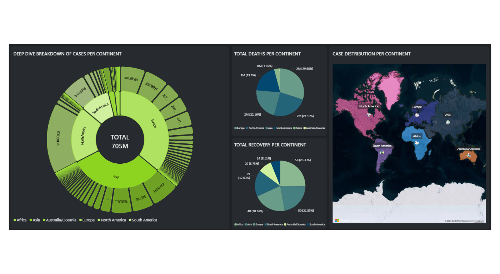
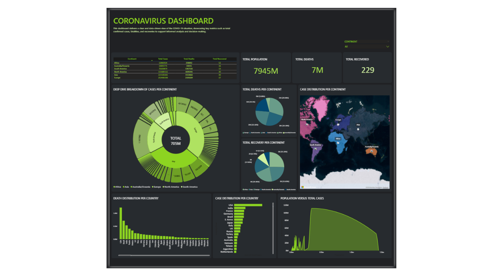

# PowerBI-WebScraping-COVID-19-Dashboard
A Power BI dashboard designed to analyze COVID-19 data scraped from Worldometer. This repository highlights web scraping, data cleaning, and visualization techniques using publicly available datasets for demonstration purposes.

🎯 Goals
- Scrape country-level COVID-19 data (cases, deaths, recoveries, population).
- Clean and transform scraped tables into structured datasets.
- Build measures for:
  - Total cases
  - Total deaths
  - Total recoveries
  - Cases per million population
- Develop multiple visualizations to present global and country-level trends clearly.

📊 Dashboard Overview

  
    
    

📊 Model Overview
Model View Screenshot

---

### Key Features
- **Dataset:** COVID-19 data scraped from Worldometer (historical, last updated April 13, 2024).
- **Visuals:**
  - Global totals (cases, deaths, recoveries)
  - Case distribution by continent
  - Top 10 countries by cases and deaths
  - Population vs. cases correlation analysis
  - Interactive filters for continent and country selection
- **Techniques Used:** Web scraping (Python BeautifulSoup), Power Query transformations, DAX measures, interactive slicers, cards, bar charts, line charts, scatter plots.

📥 Download Report
- COVID-19 Dashboard PBIX

---

⚠️ Disclaimer
This project uses publicly available historical data from Worldometer. It is intended for educational and portfolio purposes only. No live updates are provided after April 13, 2024.

